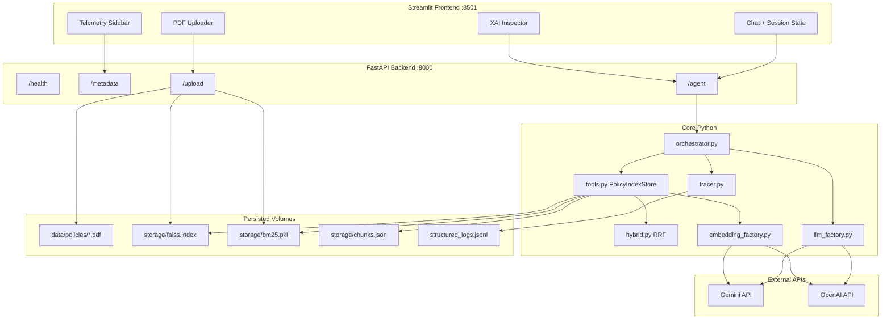

# PolicyPulse — Project Architecture Summary

> **Purpose of this document:** Handoff artifact for the next development session (e.g., README authoring). This is a technical record of what was built, how components interact, and key design decisions. It is **not** the user-facing README.

---

## Executive Overview

**PolicyPulse** is an Enterprise Policy Copilot designed as a **lean, dual-service application** suitable for local development, Docker Compose, and future Cloud Run deployment. The system answers natural-language questions about company policy PDFs using:

- A **native Python tool-calling loop** (no LangGraph, LangChain orchestration, or local LLM runtimes)
- **Hybrid retrieval** (FAISS dense + BM25 sparse fused via Reciprocal Rank Fusion)
- **API-based embeddings and chat** (Gemini or OpenAI, selected by environment)
- **Structured JSONL tracing** for observability and XAI auditing

The architecture prioritizes **low overhead**, **fast serverless cold starts**, and **explainable retrieval**.

---

## Repository Layout

```
policypulse/
├── app/
│   ├── main.py                    # FastAPI entrypoint (/health, /metadata, /agent, /upload)
│   ├── config.py                  # pydantic-settings configuration
│   ├── agents/
│   │   ├── schemas.py             # Unified messages, tool calls, AgentRequest/Response
│   │   ├── tools.py               # retrieve_policy_context + PolicyIndexStore (hybrid search)
│   │   └── orchestrator.py        # Native while-loop agent orchestration
│   ├── services/
│   │   ├── embedding_factory.py   # EmbeddingService (Gemini / OpenAI API embeddings)
│   │   └── llm_factory.py         # GeminiLLMClient / OpenAILLMClient adapters
│   ├── rag/
│   │   └── hybrid.py              # Tokenization, RRF merge, score normalization
│   └── observability/
│       └── tracer.py              # JSONL structured execution traces
├── frontend/
│   └── streamlit_app.py           # Chat UI, telemetry sidebar, XAI Inspector, PDF upload
├── scripts/
│   ├── build_index.py             # Offline FAISS + BM25 index build from PDFs
│   ├── verify_index.py            # CLI index load/search smoke test
│   └── verify_agent.py            # CLI end-to-end agent smoke test
├── data/policies/                 # Source PDF documents (volume-mounted in Docker)
├── storage/                       # Persisted indexes and chunk metadata (volume-mounted)
│   ├── faiss.index
│   ├── bm25.pkl
│   └── chunks.json
├── tests/                         # 30 pytest unit/integration tests
├── backend.Dockerfile
├── frontend.Dockerfile
├── docker-compose.yml
├── requirements.txt
├── pytest.ini
├── .env.example
└── .dockerignore
```

---

## The 5 Architectural Phases (Completed)

### Phase 1 — Foundation

**Goal:** Configuration, dependency scaffold, and structured observability.

**Deliverables:**
| File | Role |
|------|------|
| `requirements.txt` | Lean Python dependency set |
| `.env.example` | Environment variable template |
| `.gitignore` | Excludes venv, secrets, index artifacts |
| `pytest.ini` | `pythonpath = .` for reliable test imports |
| `app/config.py` | `pydantic-settings` `Settings` with provider defaults |
| `app/observability/tracer.py` | JSONL trace writer/reader |
| `tests/test_tracer.py` | Tracer unit tests |

**Key configuration (env-driven):**
- `MODEL_PROVIDER` — `gemini` | `openai`
- `MODEL_NAME` — chat model override (defaults: `gemini-2.5-flash`, `gpt-4o-mini`)
- Embedding defaults: `gemini-embedding-001`, `text-embedding-3-small`
- Paths: `POLICIES_DIR`, `FAISS_INDEX_PATH`, `BM25_INDEX_PATH`, `CHUNKS_PATH`, `LOG_PATH`
- `MAX_TOOL_ITERATIONS` — agent loop cap (default 5)
- `DEPLOYMENT_TARGET`, `BACKEND_URL`

**Trace schema (`structured_logs.jsonl`):**
```json
{
  "trace_id": "uuid",
  "timestamp": "ISO-8601",
  "query": "user question",
  "raw_intent": "model classification or first-pass content",
  "tool_calls": [{"name": "...", "args": {}, "latency_ms": 42}],
  "retrieved_chunks": [{"source": "file.pdf", "page": 3, "text": "...", "score": 0.87}],
  "latency_ms": 1234,
  "model_provider": "gemini",
  "model_name": "gemini-2.5-flash"
}
```

---

### Phase 2 — RAG Engine (FAISS + API Embeddings)

**Goal:** Index policy PDFs locally; retrieve via dense vector search without local embedding models.

**Deliverables:**
| File | Role |
|------|------|
| `app/services/embedding_factory.py` | `EmbeddingService` — Gemini/OpenAI embedding API with batching |
| `scripts/build_index.py` | PDF chunking, FAISS build, BM25 build, persistence |
| `scripts/verify_index.py` | Index verification CLI |
| `tests/test_build_index.py` | Chunking, FAISS/BM25 persistence tests |

**Indexing pipeline:**
1. Scan `data/policies/*.pdf` with `pypdf`
2. Chunk text: **800 characters**, **150 character overlap**
3. Embed chunks via active provider API (`retrieval_document` task type for Gemini)
4. Build `faiss.IndexFlatIP` on **L2-normalized** vectors (cosine similarity via inner product)
5. Build `BM25Okapi` sparse index over tokenized chunks
6. Persist:
   - `storage/faiss.index`
   - `storage/bm25.pkl` (pickle)
   - `storage/chunks.json` (metadata sidecar with `chunks[]`, `built_at`, `chunk_count`)

**Chunk metadata shape:**
```json
{"chunk_id": 0, "source_file": "handbook.pdf", "page": 1, "text": "..."}
```

**Design constraint:** No `sentence-transformers` or local embedding runtimes — keeps container lean for Cloud Run free tier.

---

### Phase 3 — Agent Orchestrator

**Goal:** Native Python tool-calling loop; provider-agnostic LLM adapters; single RAG tool.

**Deliverables:**
| File | Role |
|------|------|
| `app/agents/schemas.py` | `ChatMessage`, `UnifiedToolCall`, `LLMClient` protocol, `AgentRequest/Response` |
| `app/agents/tools.py` | `retrieve_policy_context`, `PolicyIndexStore`, tool JSON schemas |
| `app/agents/orchestrator.py` | `run_agent()` while-loop |
| `app/services/llm_factory.py` | Gemini + OpenAI chat adapters with normalized tool-call parsing |
| `scripts/verify_agent.py` | Live agent smoke test |
| `tests/test_orchestrator.py`, `tests/test_llm_factory.py` | Orchestrator and adapter tests |

**Orchestration loop:**
```
1. trace_id = uuid4
2. messages = [system_prompt, user_query]
3. WHILE iterations < MAX_TOOL_ITERATIONS:
     result = llm.complete(messages, tools=[retrieve_policy_context])
     IF no tool_calls: BREAK with final answer
     FOR each tool_call:
       execute_tool() → append TOOL message to history
4. write_trace() → structured_logs.jsonl
5. return AgentResponse(answer, trace)
```

**Single exposed tool:** `retrieve_policy_context(query: str, top_k?: int)`

**LLM adapter notes (Gemini-specific fixes applied during development):**
- Tool response messages use **`role: user`** with batched `function_response` parts (not `role: function`)
- Gemini tool schemas must **omit `default` fields** — protobuf `Schema` rejects them
- Final answer extraction uses `response.text` fallback when part-level parsing returns empty content
- Embedding model migrated from deprecated `text-embedding-004` to **`gemini-embedding-001`**

**No frameworks:** Plain Python lists of messages; provider SDK calls isolated inside `llm_factory.py` and `embedding_factory.py`.

---

### Phase 4 — FastAPI Backend + Streamlit Frontend

**Goal:** HTTP API for agent/metadata; production UI with telemetry and XAI auditing.

#### Backend (`app/main.py`)

| Route | Method | Behavior |
|-------|--------|----------|
| `/health` | GET | Liveness: `{"status": "ok"}` |
| `/metadata` | GET | Provider, models, deployment, index stats, rolling latency (last 20 traces) |
| `/agent` | POST | `{"query": "..."}` → `AgentResponse` with `answer` + `trace` |
| `/upload` | POST | PDF upload → save → rebuild index → hot-reload in memory |

**Startup (lifespan):**
- Warm-loads FAISS + BM25 via `PolicyIndexStore.load()`
- Sets `app.state.index_ready`, `app.state.bm25_index`, `app.state.policy_index_store`
- Graceful degradation if index missing (503 on `/agent`, warning in `/metadata`)

**Tests:** `tests/test_api.py` (7 tests, TestClient + mocked `run_agent`)

#### Frontend (`frontend/streamlit_app.py`)

| Feature | Implementation |
|---------|----------------|
| Chat | `st.chat_input` + `st.session_state.messages` (survives reruns) |
| Telemetry sidebar | Live `GET /metadata` — provider, models, index status, chunk/vector counts, p50/last latency |
| XAI Inspector | `st.expander` per assistant message showing trace details |
| PDF upload | `st.file_uploader` → `POST /upload` with spinner, deduped via `last_upload_key` |
| Error handling | httpx timeouts, connection errors, HTTP detail surfacing |
| Clear chat | Sidebar button resets session state |

**Inter-service networking (Docker):** `BACKEND_URL=http://backend:8000`

---

### Phase 5 — Packaging & Containerization

**Goal:** Dual-container Docker deployment with persistent volumes.

**Deliverables:**
| File | Role |
|------|------|
| `backend.Dockerfile` | `python:3.13-slim`, full `requirements.txt`, uvicorn on **8000** |
| `frontend.Dockerfile` | `python:3.13-slim`, minimal deps (`streamlit`, `httpx`), port **8501** |
| `docker-compose.yml` | Backend + frontend, `depends_on`, env wiring, volumes |
| `.dockerignore` | Excludes `.venv`, `.env`, tests, caches (secrets not baked into images) |

**Compose volumes (backend):**
```yaml
./data/policies:/app/data/policies
./storage:/app/storage
```

**Secrets:** `GEMINI_API_KEY` / `OPENAI_API_KEY` injected via host `.env` + `env_file` (not copied into image).

**Startup commands (match local dev):**
```bash
# Backend
uvicorn app.main:app --host 0.0.0.0 --port 8000

# Frontend
streamlit run frontend/streamlit_app.py --server.port=8501 --server.address=0.0.0.0 --server.headless=true
```

---

## Technology Stack

| Layer | Libraries / Tools |
|-------|-------------------|
| API server | **FastAPI**, **uvicorn**, **python-multipart** (file upload) |
| UI | **Streamlit**, **httpx** |
| Config | **pydantic**, **pydantic-settings**, **python-dotenv** |
| Dense retrieval | **faiss-cpu**, **numpy** |
| Sparse retrieval | **rank-bm25** (`BM25Okapi`) |
| PDF parsing | **pypdf** |
| LLM (chat) | **google-generativeai** (Gemini), **openai** (OpenAI) |
| Embeddings | Same provider SDKs via `EmbeddingService` |
| Serialization | **pickle** (BM25 index), **json** (chunk metadata), **jsonl** (traces) |
| Testing | **pytest** (30 tests) |
| Containers | **Docker**, **Docker Compose** |

**Explicitly not used:** LangGraph, LangChain, local model runtimes, ChromaDB, sentence-transformers.

---

## Hybrid Search: Solving the Dense Retrieval Blind Spot

### Problem observed in production testing

Short, keyword-heavy queries (e.g., *"whats the pay per hour?"*) caused **FAISS-only retrieval** to fill the `top_k=4` context window with semantically related but **wrong** passages (generic reimbursement / employers-of-record language), **excluding** the chunk containing the exact **"$80–$105"** salary figure.

**Root cause:** Dense embeddings prioritize broad semantic similarity over exact token overlap. Short queries have weak semantic signal; numerals and specific phrases are underrepresented in embedding space.

### Solution: Hybrid Search + Reciprocal Rank Fusion (RRF)

Implemented in `app/agents/tools.py` (`PolicyIndexStore.search`) and `app/rag/hybrid.py`.

**Retrieval pipeline per query:**
```
1. Dense (FAISS):  top 4 chunks by cosine similarity (IndexFlatIP, L2-normalized query/doc vectors)
2. Sparse (BM25):  top 4 chunks by keyword relevance (rank_bm25 over tokenized corpus)
3. RRF merge:      score(chunk) += 1 / (60 + rank) for each appearance in either list
4. Deduplicate:    return top 5 fused chunks (configurable via tool top_k)
5. Normalize:      RRF scores scaled to 0–1 for UI confidence display
```

**Constants (`app/rag/hybrid.py`):**
```python
RRF_K = 60
HYBRID_DENSE_K = 4
HYBRID_SPARSE_K = 4
HYBRID_FINAL_K = 5
```

**Tokenization:** `re.findall(r"[a-z0-9]+", text.lower())` — preserves numerals like `80`, `105` for BM25.

**Indexing:** Both indexes built together in `scripts/build_index.py` → `build_policy_index()`.

**Fallback:** If `storage/bm25.pkl` is missing (legacy index), dense-only search still works.

**In-memory state:** BM25 loaded at startup into `PolicyIndexStore._bm25` and mirrored to `app.state.bm25_index`. Reloaded on `/upload` without server restart.

---

## XAI Inspector (Explainable AI UI)

**Location:** `frontend/streamlit_app.py` → `render_xai_inspector()`

Rendered as an **`st.expander("XAI Inspector")`** beneath each assistant chat message. Data source: `AgentResponse.trace` returned by `POST /agent`.

**Displayed fields:**
| Field | Source |
|-------|--------|
| Trace ID (truncated) | `trace.trace_id` |
| Total latency | `trace.latency_ms` |
| Tool call count | `len(trace.tool_calls)` |
| Raw intent | `trace.raw_intent` |
| Selected tools | Name, args, per-tool `latency_ms` |
| Retrieved chunks | Source file, page, match %, progress bar, text preview |

**Score display:** Hybrid RRF scores are normalized to 0–1 in `normalize_rrf_scores()` before populating `RetrievedChunkTrace.score`. The UI renders:
- **Percentage label:** `84% Match`
- **`st.progress()` bar:** visual confidence indicator

**Trace persistence:** Every `/agent` call appends one JSON line to `structured_logs.jsonl` via `write_trace()`. `/metadata` reads last 20 traces for p50/last latency rollup.

---

## Local Volume Caching & Persistence

### Directory roles

| Path | Contents | Persistence |
|------|----------|-------------|
| `data/policies/` | Source PDF files | Docker volume mount; survives container restarts |
| `storage/faiss.index` | FAISS dense index | Docker volume mount |
| `storage/bm25.pkl` | Pickled BM25Okapi | Docker volume mount |
| `storage/chunks.json` | Chunk metadata + build timestamp | Docker volume mount |
| `structured_logs.jsonl` | Execution traces | Backend working dir (ephemeral on Cloud Run; fine for local/Docker) |

### Hot-reload without restart

`PolicyIndexStore.reload()` clears in-memory FAISS/BM25/chunk caches and reloads from `storage/`. Triggered by:
- `POST /upload` after `build_policy_index()`
- `_reload_index_state()` updates `app.state.index_ready` and `app.state.bm25_index`

### Index build triggers

1. **CLI:** `python scripts/build_index.py`
2. **API:** `POST /upload` (PDF multipart)
3. **UI:** Streamlit sidebar file uploader → `/upload`

**Post-hybrid-search note:** Existing deployments must **rebuild the index** once to generate `bm25.pkl`:
```bash
python scripts/build_index.py
```

---

## Dynamic PDF Uploader

### Backend (`POST /upload` in `app/main.py`)

1. Validate filename and `.pdf` extension
2. Sanitize path (`Path(filename).name` — no directory traversal)
3. Write bytes to `data/policies/{filename}`
4. Call `build_policy_index()` — rebuilds FAISS + BM25 + `chunks.json`
5. Call `_reload_index_state(app)` — in-memory hot reload
6. Return `UploadResponse` with `filename`, `chunk_count`, `vector_count`, `index_built_at`

### Frontend (sidebar)

- `st.file_uploader` accepts PDF only
- `st.spinner("Processing and Indexing...")` during upload
- `httpx` POST with 300s timeout (embedding API can be slow)
- Session key `last_upload_key = f"{name}:{size}"` prevents duplicate re-index on Streamlit reruns
- Success toast shows chunk/vector counts; `st.rerun()` refreshes metadata metrics

---

## Environment Variables Reference

```bash
MODEL_PROVIDER=gemini              # gemini | openai
MODEL_NAME=gemini-2.5-flash
GEMINI_API_KEY=
OPENAI_API_KEY=
DEPLOYMENT_TARGET=local            # local | docker | cloud-run
BACKEND_URL=http://127.0.0.1:8000  # frontend → backend URL
FAISS_INDEX_PATH=storage/faiss.index
BM25_INDEX_PATH=storage/bm25.pkl
CHUNKS_PATH=storage/chunks.json
LOG_PATH=structured_logs.jsonl     # or storage/structured_logs.jsonl in Docker
MAX_TOOL_ITERATIONS=5
POLICIES_DIR=data/policies
```

---

## Test Suite Summary

**30 pytest tests** across:

| Module | File | Coverage |
|--------|------|----------|
| Tracer | `test_tracer.py` | JSONL write/read |
| Index build | `test_build_index.py` | Chunking, FAISS, BM25 persistence |
| Hybrid RRF | `test_hybrid.py`, `test_hybrid_retrieval.py` | RRF math, pay-per-hour retrieval scenario |
| LLM adapters | `test_llm_factory.py` | Gemini message formatting, response parsing |
| Orchestrator | `test_orchestrator.py` | Tool loop, trace capture |
| API | `test_api.py` | /health, /metadata, /agent, /upload |

**Run all tests:**
```bash
pytest tests/ -v
```

---

## Local Development Quick Reference

```bash
# Setup
python -m venv .venv && source .venv/bin/activate  # or .\venv\Scripts\Activate.ps1
pip install -r requirements.txt
cp .env.example .env  # set GEMINI_API_KEY

# Build index
python scripts/build_index.py

# Backend
uvicorn app.main:app --reload --host 127.0.0.1 --port 8000

# Frontend
BACKEND_URL=http://127.0.0.1:8000 streamlit run frontend/streamlit_app.py

# Docker
docker compose up --build
# UI: http://localhost:8501  |  API: http://localhost:8000
```

---

## Known Notes & Future Considerations

1. **`google.generativeai` deprecation warning** — Google recommends migrating to `google.genai` SDK; not blocking, scheduled for future refactor.
2. **Cloud Run single-container option** — Original plan included one container running both uvicorn + streamlit; current implementation uses **dual containers via Compose** (cleaner separation). Cloud Run can deploy backend and frontend as separate services or combine with a shell entrypoint.
3. **`structured_logs.jsonl` on Cloud Run** — Ephemeral filesystem; consider Cloud Logging export for production durability.
4. **Index cold start** — Pre-build index into `storage/` before image build OR mount persistent volume; upload endpoint provides runtime index updates.

---

## Architectural Diagram



---

*Document generated for PolicyPulse project handoff. All five architectural phases are code-complete and verified via manual smoke tests and automated pytest suite.*
