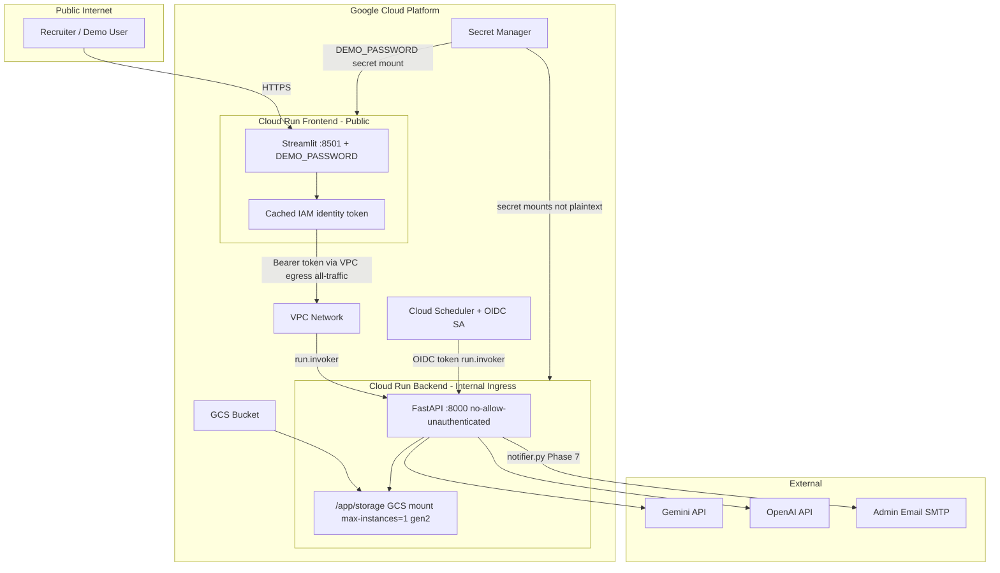
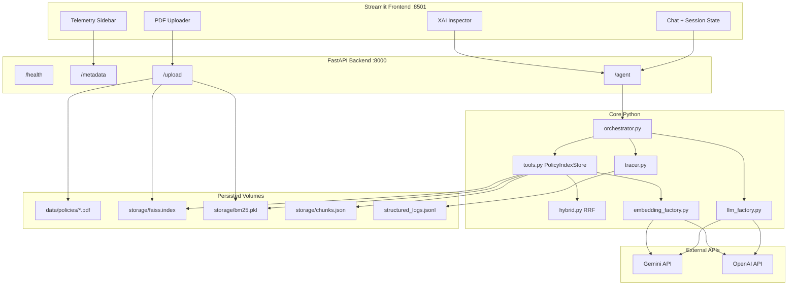

# PolicyPulse — Project Architecture Summary

> **Purpose of this document:** Handoff artifact for the next development session (e.g., README authoring). This is a technical record of what was built, how components interact, and key design decisions. It is **not** the user-facing README.

---

## Executive Overview

**PolicyPulse** is an Enterprise Policy Copilot designed as a **lean, dual-service application** suitable for local development, Docker Compose, and **Google Cloud Run deployment (Phase 6)**. The system answers natural-language questions about company policy PDFs using:

- A **native Python tool-calling loop** (no LangGraph, LangChain orchestration, or local LLM runtimes)
- **Hybrid retrieval** (FAISS dense + BM25 sparse fused via Reciprocal Rank Fusion)
- **API-based embeddings and chat** (Gemini or OpenAI, selected by environment)
- **Structured JSONL tracing** for observability and XAI auditing (Phase 7 extends this with token cost and daily audit reports)

The architecture prioritizes **low overhead**, **fast serverless cold starts**, and **explainable retrieval**.

---

## Architectural Roadmap

| Phase | Name | Status |
|-------|------|--------|
| **1** | Foundation (config, tracer, tests) | ✅ Complete |
| **2** | RAG Engine (FAISS + BM25 + API embeddings) | ✅ Complete |
| **3** | Agent Orchestrator (native tool-calling loop) | ✅ Complete |
| **4** | FastAPI Backend + Streamlit Frontend | ✅ Complete |
| **5** | Packaging & Containerization (Docker Compose) | ✅ Complete |
| **6** | Live Demo Security + Google Cloud Run Deployment | 🟡 Local complete · Cloud pending |
| **7** | Automated LLM Observability & Daily Audit Reporting | ⬜ Planned |

**Phase 6 progress:** All **local/Docker deliverables are complete** — security hardening, Cloud Run IAM client code (`streamlit_app.py` + `google-auth`), index-build `PYTHONPATH` fix, multi-doc retrieval verified, and UI dollar-sign rendering fix. **Remaining work is GCP infrastructure only:** deploy scripts, GCS volume mounts, VPC egress, Secret Manager, and dual `run.invoker` IAM bindings.

**Phase 7 scope:** Enhanced tracer token logging, daily batch audit endpoint (Cloud Scheduler OIDC auth), and SMTP executive email reports.

---

## Repository Layout

```
policypulse/
├── app/
│   ├── main.py                    # FastAPI entrypoint (/health, /metadata, /agent, /upload)
│   ├── config.py                  # pydantic-settings configuration
│   ├── agents/
│   │   ├── schemas.py             # Unified messages, tool calls, AgentRequest/Response
│   │   ├── tools.py               # retrieve_policy_context + PolicyIndexStore (hybrid search)
│   │   └── orchestrator.py        # Native while-loop agent orchestration
│   ├── services/
│   │   ├── embedding_factory.py   # EmbeddingService (Gemini / OpenAI API embeddings)
│   │   ├── llm_factory.py         # GeminiLLMClient / OpenAILLMClient adapters
│   │   └── notifier.py            # [Phase 7] SMTP daily audit email dispatch
│   ├── rag/
│   │   └── hybrid.py              # Tokenization, RRF merge, score normalization
│   └── observability/
│       └── tracer.py              # JSONL structured execution traces
├── frontend/
│   ├── streamlit_app.py           # Chat UI, telemetry, XAI Inspector, IAM auth (cloud-run gated)
│   └── .streamlit/config.toml     # Streamlit framework configs (maxUploadSize = 10)
├── scripts/
│   ├── build_index.py             # Offline FAISS + BM25 index build from PDFs
│   ├── verify_index.py            # CLI index load/search smoke test
│   └── verify_agent.py            # CLI end-to-end agent smoke test
├── data/policies/                 # Source PDF documents (volume-mounted in Docker)
├── storage/                       # Persisted indexes and chunk metadata (volume-mounted)
│   ├── faiss.index
│   ├── bm25.pkl
│   └── chunks.json
├── tests/                         # 30 pytest unit/integration tests
├── backend.Dockerfile
├── frontend.Dockerfile
├── docker-compose.yml
├── requirements.txt
├── pytest.ini
├── .env.example
└── .dockerignore
```

---

## Phases 1–5 (Completed)

### Phase 1 — Foundation

**Goal:** Configuration, dependency scaffold, and structured observability.

**Deliverables:**
| File | Role |
|------|------|
| `requirements.txt` | Lean Python dependency set |
| `.env.example` | Environment variable template |
| `.gitignore` | Excludes venv, secrets, index artifacts |
| `pytest.ini` | `pythonpath = .` for reliable test imports |
| `app/config.py` | `pydantic-settings` `Settings` with provider defaults |
| `app/observability/tracer.py` | JSONL trace writer/reader |
| `tests/test_tracer.py` | Tracer unit tests |

**Key configuration (env-driven):**
- `MODEL_PROVIDER` — `gemini` | `openai`
- `MODEL_NAME` — chat model override (defaults: `gemini-2.5-flash`, `gpt-4o-mini`)
- Embedding defaults: `gemini-embedding-001`, `text-embedding-3-small`
- Paths: `POLICIES_DIR`, `FAISS_INDEX_PATH`, `BM25_INDEX_PATH`, `CHUNKS_PATH`, `LOG_PATH`
- `MAX_TOOL_ITERATIONS` — agent loop cap (default 5)
- `DEPLOYMENT_TARGET`, `BACKEND_URL`

**Trace schema (`structured_logs.jsonl`):**
```json
{
  "trace_id": "uuid",
  "timestamp": "ISO-8601",
  "query": "user question",
  "raw_intent": "model classification or first-pass content",
  "tool_calls": [{"name": "...", "args": {}, "latency_ms": 42}],
  "retrieved_chunks": [{"source": "file.pdf", "page": 3, "text": "...", "score": 0.87}],
  "latency_ms": 1234,
  "model_provider": "gemini",
  "model_name": "gemini-2.5-flash"
}
```

---

### Phase 2 — RAG Engine (FAISS + API Embeddings)

**Goal:** Index policy PDFs locally; retrieve via dense vector search without local embedding models.

**Deliverables:**
| File | Role |
|------|------|
| `app/services/embedding_factory.py` | `EmbeddingService` — Gemini/OpenAI embedding API with batching |
| `scripts/build_index.py` | PDF chunking, FAISS build, BM25 build, persistence |
| `scripts/verify_index.py` | Index verification CLI |
| `tests/test_build_index.py` | Chunking, FAISS/BM25 persistence tests |

**Indexing pipeline:**
1. Scan `data/policies/*.pdf` with `pypdf`
2. Chunk text: **800 characters**, **150 character overlap**
3. Embed chunks via active provider API (`retrieval_document` task type for Gemini)
4. Build `faiss.IndexFlatIP` on **L2-normalized** vectors (cosine similarity via inner product)
5. Build `BM25Okapi` sparse index over tokenized chunks
6. Persist:
   - `storage/faiss.index`
   - `storage/bm25.pkl` (pickle)
   - `storage/chunks.json` (metadata sidecar with `chunks[]`, `built_at`, `chunk_count`)

**Chunk metadata shape:**
```json
{"chunk_id": 0, "source_file": "handbook.pdf", "page": 1, "text": "..."}
```

**Design constraint:** No `sentence-transformers` or local embedding runtimes — keeps container lean for Cloud Run free tier.

---

### Phase 3 — Agent Orchestrator

**Goal:** Native Python tool-calling loop; provider-agnostic LLM adapters; single RAG tool.

**Deliverables:**
| File | Role |
|------|------|
| `app/agents/schemas.py` | `ChatMessage`, `UnifiedToolCall`, `LLMClient` protocol, `AgentRequest/Response` |
| `app/agents/tools.py` | `retrieve_policy_context`, `PolicyIndexStore`, tool JSON schemas |
| `app/agents/orchestrator.py` | `run_agent()` while-loop |
| `app/services/llm_factory.py` | Gemini + OpenAI chat adapters with normalized tool-call parsing |
| `scripts/verify_agent.py` | Live agent smoke test |
| `tests/test_orchestrator.py`, `tests/test_llm_factory.py` | Orchestrator and adapter tests |

**Orchestration loop:**
```
1. trace_id = uuid4
2. messages = [system_prompt, user_query]
3. WHILE iterations < MAX_TOOL_ITERATIONS:
     result = llm.complete(messages, tools=[retrieve_policy_context])
     IF no tool_calls: BREAK with final answer
     FOR each tool_call:
       execute_tool() → append TOOL message to history
4. write_trace() → structured_logs.jsonl
5. return AgentResponse(answer, trace)
```

**Single exposed tool:** `retrieve_policy_context(query: str, top_k?: int)`

**LLM adapter notes (Gemini-specific fixes applied during development):**
- Tool response messages use **`role: user`** with batched `function_response` parts (not `role: function`)
- Gemini tool schemas must **omit `default` fields** — protobuf `Schema` rejects them
- Final answer extraction uses `response.text` fallback when part-level parsing returns empty content
- Embedding model migrated from deprecated `text-embedding-004` to **`gemini-embedding-001`**

**No frameworks:** Plain Python lists of messages; provider SDK calls isolated inside `llm_factory.py` and `embedding_factory.py`.

---

### Phase 4 — FastAPI Backend + Streamlit Frontend

**Goal:** HTTP API for agent/metadata; production UI with telemetry and XAI auditing.

#### Backend (`app/main.py`)

| Route | Method | Behavior |
|-------|--------|----------|
| `/health` | GET | Liveness: `{"status": "ok"}` |
| `/metadata` | GET | Provider, models, deployment, index stats, rolling latency (last 20 traces) |
| `/agent` | POST | `{"query": "..."}` → `AgentResponse` with `answer` + `trace` |
| `/upload` | POST | PDF upload → save → rebuild index → hot-reload in memory |

**Startup (lifespan):**
- Warm-loads FAISS + BM25 via `PolicyIndexStore.load()`
- Sets `app.state.index_ready`, `app.state.bm25_index`, `app.state.policy_index_store`
- Graceful degradation if index missing (503 on `/agent`, warning in `/metadata`)

**Tests:** `tests/test_api.py` (7 tests, TestClient + mocked `run_agent`)

#### Frontend (`frontend/streamlit_app.py`)

| Feature | Implementation |
|---------|----------------|
| Chat | `st.chat_input` + `st.session_state.messages` (survives reruns) |
| Telemetry sidebar | Live `GET /metadata` — provider, models, index status, chunk/vector counts, p50/last latency |
| XAI Inspector | `st.expander` per assistant message showing trace details |
| PDF upload | `st.file_uploader` → `POST /upload` with spinner, deduped via `last_upload_key` |
| Error handling | httpx timeouts, connection errors, HTTP detail surfacing |
| Clear chat | Sidebar button resets session state |

**Inter-service networking (Docker):** `BACKEND_URL=http://backend:8000`

---

### Phase 5 — Packaging & Containerization

**Goal:** Dual-container Docker deployment with persistent volumes.

**Deliverables:**
| File | Role |
|------|------|
| `backend.Dockerfile` | `python:3.13-slim`, full `requirements.txt`, `PYTHONPATH=/app`, uvicorn on **8000** |
| `frontend.Dockerfile` | `python:3.13-slim`, minimal deps (`streamlit`, `httpx`), port **8501** |
| `docker-compose.yml` | Backend + frontend, `depends_on`, env wiring, volumes |
| `.dockerignore` | Excludes `.venv`, `.env`, tests, caches (secrets not baked into images) |

**Compose volumes (backend):**
```yaml
./data/policies:/app/data/policies
./storage:/app/storage
```

**Secrets:** `GEMINI_API_KEY` / `OPENAI_API_KEY` injected via host `.env` + `env_file` (not copied into image).

**Startup commands (match local dev):**
```bash
# Backend
uvicorn app.main:app --host 0.0.0.0 --port 8000

# Frontend
streamlit run frontend/streamlit_app.py --server.port=8501 --server.address=0.0.0.0 --server.headless=true
```

---

## Phase 6 — Live Demo Security + Google Cloud Run Deployment

**Goal:** Deploy PolicyPulse as a recruiter-facing live demo on Google Cloud Run with safety switches that protect API credits, while preserving dynamic PDF upload and hybrid index persistence across serverless restarts.

**Status:** ✅ **Local/Docker implementation complete** · ⬜ **GCP deployment pending**

### 6.1 Security Hardening (✅ Complete)

| Deliverable | Implementation |
|-------------|----------------|
| **Password gateway** | `frontend/streamlit_app.py` — `DEMO_PASSWORD` env var (default `suku-pulse`); blocks sidebar/chat until authenticated |
| **Backend upload guardrail** | `app/main.py` — `MAX_UPLOAD_SIZE_BYTES = 10MB`; returns HTTP 413 when exceeded |
| **Streamlit upload guardrail** | `frontend/.streamlit/config.toml` — `[server] maxUploadSize = 10` |
| **UI alignment** | File uploader label/help explicitly states 10MB limit |
| **Cloud-readiness config** | `app/config.py` — `deployment_target` normalized to `local \| docker \| cloud-run`; `resolved_log_path` maps traces to `/tmp` on Cloud Run |
| **Compose wiring** | `docker-compose.yml` — `./frontend/.streamlit:/app/.streamlit` volume mount |

**Design intent:** "Live Demo with Safety Switches" — public access is allowed, but token consumption and storage abuse are constrained at the UI, framework, and API layers.

### 6.1b Local Cloud-Prep & UI Polish (✅ Complete)

| Deliverable | Implementation |
|-------------|----------------|
| **IAM identity token client** | `frontend/streamlit_app.py` — cached metadata-server token on Cloud Run; gated on `K_SERVICE` / `DEPLOYMENT_TARGET=cloud-run`; skipped in local/Docker |
| **`google-auth` dependency** | `frontend.Dockerfile` — pip install for identity token fetch |
| **Index build in Docker** | `backend.Dockerfile` — `PYTHONPATH=/app` so `scripts/build_index.py` imports `app` inside containers |
| **Dollar-sign rendering fix** | `escape_markdown_dollars()` applied to assistant answers and XAI Raw intent panel (prevents Streamlit LaTeX mangling of `$75`/`$110`) |
| **Multi-doc retrieval verified** | Local smoke tests passed: doc-scoped queries, ambiguous cross-doc attribution, varied RRF match scores |

### 6.2 Cloud Run Deployment Strategy (⬜ Pending — GCP infrastructure only)

#### Persistent vector/sparse index strategy

**Do NOT bake** `faiss.index`, `bm25.pkl`, or `chunks.json` into the Docker image. Baking indexes into the image would break dynamic PDF upload across serverless instance restarts and force image rebuilds on every index change.

**Finalized approach:** Attach a **Google Cloud Storage (GCS) volume mount** directly to the Cloud Run backend service container. The GCS bucket mounts to `/app/storage` inside the container, matching the existing local/Docker path contract:

```
GCS bucket  →  /app/storage/faiss.index
            →  /app/storage/bm25.pkl
            →  /app/storage/chunks.json
            →  /app/storage/structured_logs.jsonl  (optional co-location)
```

**Why this works with existing code:**
- `app/config.py` already defaults `FAISS_INDEX_PATH`, `BM25_INDEX_PATH`, and `CHUNKS_PATH` under `storage/`
- `PolicyIndexStore.load()` / `reload()` read from these paths with no code changes required for GCS-backed storage
- `POST /upload` → `build_policy_index()` → `_reload_index_state()` writes back to the same mount, preserving hot-reload behavior

**Readiness check (pre-deploy):** Verify backend container expects indexes at `/app/storage` and that `POLICIES_DIR` (`data/policies`) has a parallel persistence strategy (separate GCS mount or co-located bucket prefix) so uploaded PDFs survive restarts.

#### Service topology

Deploy as **two Cloud Run services** (mirrors current Docker Compose separation):

| Service | Image | Port | Ingress | Egress | Auth |
|---------|-------|------|---------|--------|------|
| **Backend** | `backend.Dockerfile` | 8000 | **Internal only** | Default | `--no-allow-unauthenticated` |
| **Frontend** | `frontend.Dockerfile` | 8501 | **All** (public) | **Direct VPC** (`--vpc-egress=all-traffic`) | Public UI + `DEMO_PASSWORD` gate |

#### Cloud Run network ingress & egress topology (mandatory)

These networking rules are **required before production Cloud Run deployment** and define the zero-trust boundary between public users and backend API routes.

##### Backend ingress — Internal Only

Set the backend Cloud Run service ingress to **`Internal`** (`--ingress=internal`):

- Blocks direct public internet access to `POST /agent`, `POST /upload`, `/metadata`, and all other backend routes
- Ensures all user-facing API traffic **must** originate from an authenticated internal caller (Streamlit frontend or Cloud Scheduler)
- Direct curl/browser calls to the backend Cloud Run URL from the public internet **must fail**

##### Frontend Direct VPC egress

Configure the Streamlit frontend service with **Direct VPC Egress** (`--vpc-egress=all-traffic`):

- Routes all outbound HTTP(S) from the frontend container through the VPC network
- Enables the frontend to reach the **internal-ingress** backend Cloud Run URL over Google's private networking path
- Required companion to `--ingress=internal` on the backend — without VPC egress, the frontend cannot reliably reach an internal-only backend

**Example frontend deploy flags:**
```bash
gcloud run deploy policypulse-frontend \
  --vpc-egress=all-traffic \
  --network=<vpc-network> \
  --subnet=<subnet> \
  ...
```

##### Zero-trust IAM invoker bindings (two principals)

Enforce authenticated invocation on the backend. With `--no-allow-unauthenticated`, `roles/run.invoker` is **per-principal** — the backend IAM policy on the Cloud Run service **must include two separate grants**: the frontend runtime service account (Phase 6) and the Cloud Scheduler service account (Phase 7). Verify post-deploy with `gcloud run services get-iam-policy <backend-service> --region=<region>`.

| Setting | Value | Purpose |
|---------|-------|---------|
| `--no-allow-unauthenticated` | Backend service | Rejects requests without a valid Google-signed identity token |
| `roles/run.invoker` | **Frontend runtime service account** → backend | Permits Streamlit to call `/metadata`, `/agent`, `/upload` |
| `roles/run.invoker` | **Scheduler service account** → backend (Phase 7) | Permits Cloud Scheduler to call `/cron/daily-report` |

**Platform-level auth (no backend code changes):** Cloud Run validates the identity token **before** the request reaches the FastAPI app. No IAM token parsing logic is required in `app/main.py`.

**End-to-end traffic flow:**
```
Public internet
  → Streamlit frontend (DEMO_PASSWORD gate, public ingress)
  → VPC egress (all-traffic)
  → Backend (internal ingress, IAM invoker required)
  → FastAPI handlers
```

##### Frontend IAM identity token integration (✅ Complete)

**File:** `frontend/streamlit_app.py`

Each outbound `httpx` call to the backend (`/metadata`, `/agent`, `/upload`) attaches a Google-signed identity token when running on Cloud Run:

1. **Fetch token** from the Compute Engine metadata server (available inside Cloud Run gen2 containers)
2. **Audience** = backend's bare Cloud Run URL with **no path** (e.g., `https://policypulse-backend-xxxxx-uc.a.run.app`)
3. **Attach header:** `Authorization: Bearer <identity_token>`
4. **Cache the token** in module-level or session state; refresh before its ~1-hour expiry — do **not** fetch on every request

**Environment-conditional gating (critical for local dev parity):**

Only activate identity token logic when running on Cloud Run. Detect via:
- `DEPLOYMENT_TARGET=cloud-run` env var, **or**
- Cloud Run-provided `K_SERVICE` env var (always set in Cloud Run, absent locally)

When `deployment_target` is `local` or `docker` (Docker Compose), **skip token fetch entirely**. The metadata server is unavailable outside Cloud Run; an unconditional fetch **will break local development**.

**Pseudocode pattern:**
```python
def get_auth_headers() -> dict[str, str]:
    if not _is_cloud_run():
        return {}
    token = _get_cached_identity_token(audience=BACKEND_URL.rstrip("/"))
    return {"Authorization": f"Bearer {token}"}

# httpx calls:
client.get(f"{backend_url}/metadata", headers=get_auth_headers())
```

**Dependency:** `frontend.Dockerfile` installs `google-auth` alongside `streamlit` and `httpx`.

Use `google.auth.transport.requests` + `google.oauth2.id_token.fetch_id_token()` for metadata-server token retrieval.

#### Concurrency & GCS FUSE guardrails (mandatory)

The GCS volume mount at `/app/storage` is **not safe for concurrent multi-writer access**. Index rebuilds write three interdependent artifacts (`faiss.index`, `bm25.pkl`, `chunks.json`) non-atomically — parallel instances risk index tearing and corrupted retrieval state.

**Required backend deployment settings:**

| Setting | Value | Rationale |
|---------|-------|-----------|
| `--max-instances` | `1` | Single writer; prevents multi-instance race conditions on GCS-mounted index files |
| `run.googleapis.com/execution-environment` | `gen2` | Required for GCS CSI driver / Cloud Storage volume mount compatibility |

**Deliberate design trade-off:** `max-instances=1` **sacrifices horizontal scaling** to guarantee index consistency in a single-process architecture. This is intentional — PolicyPulse's current index rebuild pipeline is not concurrency-safe. Revisit only if index writes become atomic or migrate to a managed vector store.

**Example annotation (Cloud Run service YAML):**
```yaml
metadata:
  annotations:
    run.googleapis.com/execution-environment: gen2
```

**Example backend deploy flags:**
```bash
gcloud run deploy policypulse-backend \
  --max-instances=1 \
  --execution-environment=gen2 \
  --ingress=internal \
  --no-allow-unauthenticated \
  ...
```

#### Secrets & scheduler governance

##### GCP Secret Manager (mandatory)

**Do NOT** inject `GEMINI_API_KEY`, `OPENAI_API_KEY`, or `DEMO_PASSWORD` as plaintext Cloud Run environment variables.

Route all sensitive values through **GCP Secret Manager**, mounted as secret references:

| Secret | Service | Secret Manager key (example) |
|--------|---------|------------------------------|
| `GEMINI_API_KEY` | Backend | `policypulse-gemini-api-key` |
| `OPENAI_API_KEY` | Backend | `policypulse-openai-api-key` |
| `DEMO_PASSWORD` | Frontend | `policypulse-demo-password` |
| `SMTP_PASSWORD` | Backend (Phase 7) | `policypulse-smtp-password` |

**Example deploy pattern:**
```bash
gcloud run deploy policypulse-backend \
  --set-secrets=GEMINI_API_KEY=policypulse-gemini-api-key:latest,OPENAI_API_KEY=policypulse-openai-api-key:latest

gcloud run deploy policypulse-frontend \
  --set-secrets=DEMO_PASSWORD=policypulse-demo-password:latest
```

Non-sensitive config (`DEPLOYMENT_TARGET`, `BACKEND_URL`, index paths) may remain as plain env vars.

##### Cloud Scheduler OIDC (Phase 7 — see §7.2)

The `/cron/daily-report` endpoint uses the same zero-trust IAM model: Cloud Scheduler attaches a native OIDC token; the Scheduler service account holds `roles/run.invoker` on the backend. Cloud Run validates the token at the platform level.

#### Environment & secrets summary

| Variable / Secret | Service | Source |
|-------------------|---------|--------|
| `GEMINI_API_KEY` | Backend | **Secret Manager** → Cloud Run secret mount |
| `OPENAI_API_KEY` | Backend | **Secret Manager** → Cloud Run secret mount |
| `DEMO_PASSWORD` | Frontend | **Secret Manager** → Cloud Run secret mount |
| `BACKEND_URL` | Frontend | Plain Cloud Run env (backend bare URL, no path) |
| `DEPLOYMENT_TARGET` | Frontend + Backend | Plain Cloud Run env (`cloud-run`) |
| `K_SERVICE` | Frontend + Backend | Auto-injected by Cloud Run (detection signal) |

**Local/Docker parity note:** Frontend `docker-compose.yml` currently passes `BACKEND_URL` but not `DEMO_PASSWORD` via `env_file`. Local/Docker runs skip IAM identity tokens entirely; Cloud Run injects secrets via Secret Manager instead of `.env` plaintext.

#### Pending deliverables (GCP infrastructure)

| File / Artifact | Role |
|-----------------|------|
| `scripts/deploy_cloud_run.sh` (or equivalent) | Deploy with `--ingress=internal`, `--no-allow-unauthenticated`, `--max-instances=1`, `--execution-environment=gen2`, `--vpc-egress=all-traffic` |
| GCS bucket + Cloud Run volume binding | Persistent `/app/storage` mount (gen2 + CSI) |
| Cloud Run service YAML / `gcloud run deploy` flags | Volume mount, Secret Manager refs, VPC network/subnet, ingress, scaling guardrails |
| Secret Manager entries | API keys, demo password, SMTP credentials (Phase 7) |
| IAM bindings | Frontend SA → `roles/run.invoker` on backend; Scheduler SA → `roles/run.invoker` on backend (Phase 7) |

---

## Phase 7 — Automated LLM Observability & Daily Audit Reporting (Planned)

**Goal:** Elevate production auditing with automated batch telemetry — token cost tracking, grounding/faithfulness metrics, and daily executive email summaries.

### 7.1 Enhanced Tracer Logging (`app/observability/tracer.py`)

Extend `ExecutionTrace` schema and capture logic to include:

| New field | Source | Purpose |
|-----------|--------|---------|
| `prompt_tokens` | LLM API response metadata | Input token cost per query |
| `completion_tokens` | LLM API response metadata | Output token cost per query |
| `grounded_response` | Post-processing boolean | `true` if response included valid policy chunk citations |

**Implementation notes:**
- Extract token counts from Gemini/OpenAI response objects inside `app/services/llm_factory.py` and propagate through the orchestrator to `write_trace()`
- `grounded_response` logic: set `true` when `retrieved_chunks` is non-empty **and** the final answer references at least one cited source (file name or page marker)

**Updated trace schema (Phase 7 target):**
```json
{
  "trace_id": "uuid",
  "timestamp": "ISO-8601",
  "query": "user question",
  "raw_intent": "...",
  "tool_calls": [...],
  "retrieved_chunks": [...],
  "latency_ms": 1234,
  "prompt_tokens": 842,
  "completion_tokens": 156,
  "grounded_response": true,
  "model_provider": "gemini",
  "model_name": "gemini-2.5-flash"
}
```

### 7.2 Daily Batch Audit Endpoint

**Route:** `GET` or `POST /cron/daily-report` on the FastAPI backend.

**Trigger:** Google Cloud Scheduler (production) or local CRON (development).

**Aggregations from `structured_logs.jsonl` (daily window):**

| Metric | Calculation |
|--------|-------------|
| Total queries processed | Count of traces in 24h window |
| Average latency | Mean of `latency_ms` |
| Grounding / faithfulness rate | `%` of traces where `grounded_response == true` |
| Citation success rate | `%` of traces with non-empty `retrieved_chunks` |
| Total token cost | Sum of `prompt_tokens + completion_tokens` |

**Authentication (mandatory for production):**

Configure Cloud Scheduler to invoke `/cron/daily-report` using **native OIDC token authentication** — not a shared secret header. This follows the same zero-trust IAM model as the frontend → backend path (Phase 6).

| Component | Configuration |
|-----------|---------------|
| **Cloud Scheduler job** | HTTP target → backend `/cron/daily-report`; attach OIDC token signed by a dedicated Scheduler service account |
| **IAM** | Grant the Scheduler service account `roles/run.invoker` on the backend Cloud Run service |
| **Platform validation** | Cloud Run validates the OIDC bearer token at the platform level before the request reaches FastAPI — **no IAM token parsing required in backend code** |
| **FastAPI route** | Implements report aggregation and email dispatch logic only; relies on Cloud Run `--no-allow-unauthenticated` + `run.invoker` for access control |

**Why OIDC over shared secrets:** Aligns with GCP-native identity; no long-lived secret in Scheduler job config; consistent with internal-ingress backend and frontend IAM identity token pattern.

**Local development fallback:** Use a shared `CRON_SECRET` header env var for local CRON only; do not use this pattern in Cloud Run production.

### 7.3 Automated Email Dispatch (`app/services/notifier.py`)

**New module:** `app/services/notifier.py`

**Transport:** Standard Python `smtplib` (no third-party email SDK).

**Behavior:**
1. Receive aggregated daily metrics from the audit endpoint
2. Render a formatted **HTML executive summary** (query volume, latency, grounding rate, token usage)
3. Dispatch via SMTP to configured admin email

**Configuration (env-driven, to be added):**
```bash
SMTP_HOST=
SMTP_PORT=587
SMTP_USER=
SMTP_PASSWORD=          # Secret Manager in production (policypulse-smtp-password)
ADMIN_EMAIL=
```

### Phase 7 pending deliverables

| File | Role |
|------|------|
| `app/observability/tracer.py` | Extended schema + token/grounding fields |
| `app/services/llm_factory.py` | Token metadata extraction from API responses |
| `app/services/notifier.py` | SMTP HTML email dispatch |
| `app/main.py` | `/cron/daily-report` route (report logic only; auth enforced by Cloud Run IAM) |
| `tests/test_tracer.py`, `tests/test_notifier.py` | Unit tests for new fields and email formatting |
| Cloud Scheduler job config | OIDC-authenticated daily trigger with `run.invoker` IAM binding |

---

## Next Immediate Tasks

1. **Prepare Cloud Run deployment scripts** — GCS bucket + volume mount at `/app/storage`, Secret Manager secrets (no plaintext), backend `--ingress=internal --no-allow-unauthenticated`, frontend `--vpc-egress=all-traffic`, dual `run.invoker` IAM bindings.
2. **Deploy and smoke-test on GCP** — negative test (direct backend URL fails) before positive UI tests; verify IAM policy has both frontend and Scheduler SAs.
3. **Phase 7 (after live demo)** — Extend `tracer.py`, add `notifier.py`, `/cron/daily-report`, Cloud Scheduler OIDC job.

---

## Technology Stack

| Layer | Libraries / Tools |
|-------|-------------------|
| API server | **FastAPI**, **uvicorn**, **python-multipart** (file upload) |
| UI | **Streamlit**, **httpx**, **google-auth** (Phase 6 — IAM identity tokens) |
| Config | **pydantic**, **pydantic-settings**, **python-dotenv** |
| Dense retrieval | **faiss-cpu**, **numpy** |
| Sparse retrieval | **rank-bm25** (`BM25Okapi`) |
| PDF parsing | **pypdf** |
| LLM (chat) | **google-generativeai** (Gemini), **openai** (OpenAI) |
| Embeddings | Same provider SDKs via `EmbeddingService` |
| Serialization | **pickle** (BM25 index), **json** (chunk metadata), **jsonl** (traces) |
| Testing | **pytest** (30 tests) |
| Containers | **Docker**, **Docker Compose** |
| Cloud (Phase 6) | **Google Cloud Run**, **GCS volume mounts**, **Direct VPC Egress**, **Secret Manager**, **Cloud Scheduler** (Phase 7) |
| Email (Phase 7) | **smtplib** (stdlib SMTP) |

**Explicitly not used:** LangGraph, LangChain, local model runtimes, ChromaDB, sentence-transformers.

---

## Hybrid Search: Solving the Dense Retrieval Blind Spot

### Problem observed in production testing

Short, keyword-heavy queries (e.g., *"whats the pay per hour?"*) caused **FAISS-only retrieval** to fill the `top_k=4` context window with semantically related but **wrong** passages (generic reimbursement / employers-of-record language), **excluding** the chunk containing the exact **"$80–$105"** salary figure.

**Root cause:** Dense embeddings prioritize broad semantic similarity over exact token overlap. Short queries have weak semantic signal; numerals and specific phrases are underrepresented in embedding space.

### Solution: Hybrid Search + Reciprocal Rank Fusion (RRF)

Implemented in `app/agents/tools.py` (`PolicyIndexStore.search`) and `app/rag/hybrid.py`.

**Retrieval pipeline per query:**
```
1. Dense (FAISS):  top 4 chunks by cosine similarity (IndexFlatIP, L2-normalized query/doc vectors)
2. Sparse (BM25):  top 4 chunks by keyword relevance (rank_bm25 over tokenized corpus)
3. RRF merge:      score(chunk) += 1 / (60 + rank) for each appearance in either list
4. Deduplicate:    return top 5 fused chunks (configurable via tool top_k)
5. Normalize:      RRF scores scaled to 0–1 for UI confidence display
```

**Constants (`app/rag/hybrid.py`):**
```python
RRF_K = 60
HYBRID_DENSE_K = 4
HYBRID_SPARSE_K = 4
HYBRID_FINAL_K = 5
```

**Tokenization:** `re.findall(r"[a-z0-9]+", text.lower())` — preserves numerals like `80`, `105` for BM25.

**Indexing:** Both indexes built together in `scripts/build_index.py` → `build_policy_index()`.

**Fallback:** If `storage/bm25.pkl` is missing (legacy index), dense-only search still works.

**In-memory state:** BM25 loaded at startup into `PolicyIndexStore._bm25` and mirrored to `app.state.bm25_index`. Reloaded on `/upload` without server restart.

---

## XAI Inspector (Explainable AI UI)

**Location:** `frontend/streamlit_app.py` → `render_xai_inspector()`

Rendered as an **`st.expander("XAI Inspector")`** beneath each assistant chat message. Data source: `AgentResponse.trace` returned by `POST /agent`.

**Displayed fields:**
| Field | Source |
|-------|--------|
| Trace ID (truncated) | `trace.trace_id` |
| Total latency | `trace.latency_ms` |
| Tool call count | `len(trace.tool_calls)` |
| Raw intent | `trace.raw_intent` |
| Selected tools | Name, args, per-tool `latency_ms` |
| Retrieved chunks | Source file, page, match %, progress bar, text preview |

**Score display:** Hybrid RRF scores are normalized to 0–1 in `normalize_rrf_scores()` before populating `RetrievedChunkTrace.score`. The UI renders:
- **Percentage label:** `84% Match`
- **`st.progress()` bar:** visual confidence indicator

**Trace persistence:** Every `/agent` call appends one JSON line to `structured_logs.jsonl` via `write_trace()`. `/metadata` reads last 20 traces for p50/last latency rollup.

---

## Local Volume Caching & Persistence

### Directory roles

| Path | Contents | Persistence |
|------|----------|-------------|
| `data/policies/` | Source PDF files | Docker volume mount; survives container restarts |
| `storage/faiss.index` | FAISS dense index | Docker volume mount |
| `storage/bm25.pkl` | Pickled BM25Okapi | Docker volume mount |
| `storage/chunks.json` | Chunk metadata + build timestamp | Docker volume mount; **GCS volume mount on Cloud Run (Phase 6)** |
| `structured_logs.jsonl` | Execution traces | Backend working dir locally; `storage/` in Docker; GCS-backed on Cloud Run |

### Hot-reload without restart

`PolicyIndexStore.reload()` clears in-memory FAISS/BM25/chunk caches and reloads from `storage/`. Triggered by:
- `POST /upload` after `build_policy_index()`
- `_reload_index_state()` updates `app.state.index_ready` and `app.state.bm25_index`

### Index build triggers

1. **CLI:** `python scripts/build_index.py` (local venv) or `docker compose run --rm backend python scripts/build_index.py` (backend image sets `PYTHONPATH=/app`)
2. **API:** `POST /upload` (PDF multipart)
3. **UI:** Streamlit sidebar file uploader → `/upload`

After a CLI rebuild in Docker, run `docker compose restart backend` to reload indexes in memory.

**Post-hybrid-search note:** Existing deployments must **rebuild the index** once to generate `bm25.pkl`:
```bash
python scripts/build_index.py
# Docker:
docker compose run --rm backend python scripts/build_index.py
docker compose restart backend
```

---

## Dynamic PDF Uploader

### Backend (`POST /upload` in `app/main.py`)

1. Validate filename and `.pdf` extension
2. Enforce **10MB maximum file size** (HTTP 413 if exceeded)
3. Sanitize path (`Path(filename).name` — no directory traversal)
4. Write bytes to `data/policies/{filename}`
5. Call `build_policy_index()` — rebuilds FAISS + BM25 + `chunks.json`
6. Call `_reload_index_state(app)` — in-memory hot reload
7. Return `UploadResponse` with `filename`, `chunk_count`, `vector_count`, `index_built_at`

### Frontend (sidebar)

- Password gateway (`DEMO_PASSWORD`) must be passed before sidebar/upload is accessible
- `st.file_uploader` accepts PDF only; label/help states **Max 10MB**
- Streamlit `maxUploadSize = 10` enforced via `frontend/.streamlit/config.toml`
- `st.spinner("Processing and Indexing...")` during upload
- `httpx` POST with 300s timeout (embedding API can be slow)
- Session key `last_upload_key = f"{name}:{size}"` prevents duplicate re-index on Streamlit reruns
- Success toast shows chunk/vector counts; `st.rerun()` refreshes metadata metrics

---

## Environment Variables Reference

```bash
MODEL_PROVIDER=gemini              # gemini | openai
MODEL_NAME=gemini-2.5-flash
GEMINI_API_KEY=
OPENAI_API_KEY=
DEPLOYMENT_TARGET=local            # local | docker | cloud-run
BACKEND_URL=http://127.0.0.1:8000  # frontend → backend URL
DEMO_PASSWORD=                     # Streamlit demo gateway (default fallback: suku-pulse)
FAISS_INDEX_PATH=storage/faiss.index
BM25_INDEX_PATH=storage/bm25.pkl
CHUNKS_PATH=storage/chunks.json
LOG_PATH=structured_logs.jsonl     # or storage/structured_logs.jsonl in Docker
MAX_TOOL_ITERATIONS=5
POLICIES_DIR=data/policies
```

---

## Test Suite Summary

**30 pytest tests** across:

| Module | File | Coverage |
|--------|------|----------|
| Tracer | `test_tracer.py` | JSONL write/read |
| Index build | `test_build_index.py` | Chunking, FAISS, BM25 persistence |
| Hybrid RRF | `test_hybrid.py`, `test_hybrid_retrieval.py` | RRF math, pay-per-hour retrieval scenario |
| LLM adapters | `test_llm_factory.py` | Gemini message formatting, response parsing |
| Orchestrator | `test_orchestrator.py` | Tool loop, trace capture |
| API | `test_api.py` | /health, /metadata, /agent, /upload |

**Run all tests:**
```bash
pytest tests/ -v
```

---

## Local Development Quick Reference

```bash
# Setup
python -m venv .venv && source .venv/bin/activate  # or .\venv\Scripts\Activate.ps1
pip install -r requirements.txt
cp .env.example .env  # set GEMINI_API_KEY

# Build index
python scripts/build_index.py

# Backend
uvicorn app.main:app --reload --host 127.0.0.1 --port 8000

# Frontend
BACKEND_URL=http://127.0.0.1:8000 streamlit run frontend/streamlit_app.py

# Docker
docker compose up --build
# UI: http://localhost:8501  |  API: http://localhost:8000
```

---

## Known Notes & Future Considerations

1. **`google.generativeai` deprecation warning** — Google recommends migrating to `google.genai` SDK; not blocking, scheduled for future refactor.
2. **GCS policies mount (Phase 6)** — Index artifacts persist via GCS volume at `/app/storage`; `data/policies/` requires a separate persistence strategy (second GCS mount or shared bucket prefix) for uploaded PDFs to survive Cloud Run restarts.
3. **`DEMO_PASSWORD` in Docker Compose** — Frontend service does not yet load `env_file`; Cloud Run deployment must inject `DEMO_PASSWORD` (via Secret Manager) and `BACKEND_URL` explicitly on the frontend service.
4. **Backend ingress + IAM (Phase 6 + 7)** — Backend **must** use `--ingress=internal --no-allow-unauthenticated`. Two **separate** `roles/run.invoker` grants on the backend service: (a) frontend SA for chat/upload, (b) Scheduler SA for `/cron/daily-report`. Confirm both members appear in `gcloud run services get-iam-policy`. Frontend **must** attach cached IAM identity tokens on httpx calls (cloud-run only).
5. **Frontend VPC egress (Phase 6)** — Frontend **must** use `--vpc-egress=all-traffic` to reach internal-ingress backend over VPC networking.
6. **GCS FUSE single-writer (Phase 6)** — Backend **must** use `--max-instances=1` and `run.googleapis.com/execution-environment: gen2`; deliberate trade-off sacrificing horizontal scale for index consistency.
7. **IAM token gating (Phase 6)** — Identity token fetch in `streamlit_app.py` **must** be conditional on `cloud-run` / `K_SERVICE`; unconditional fetch breaks local Docker Compose.
8. **Phase 7 cron auth** — `/cron/daily-report` uses Cloud Scheduler native OIDC; Scheduler SA holds its **own** `roles/run.invoker` binding (distinct from frontend SA). Platform validates token — no shared-secret headers in production.
9. **SMTP credentials (Phase 7)** — Store `SMTP_PASSWORD` in Secret Manager; never commit to `.env` in version control.

---

## Cloud Run Architecture (Phase 6 Target)


```mermaid
flowchart TB
    subgraph public [Public Internet]
        User[Recruiter / Demo User]
    end

    subgraph gcp [Google Cloud Platform]
        Scheduler[Cloud Scheduler + OIDC SA]
        Secrets[Secret Manager]
        VPC[VPC Network]
        GCS[GCS Bucket]
        subgraph cr_backend [Cloud Run Backend - Internal Ingress]
            API["FastAPI :8000 no-allow-unauthenticated"]
            StorageMount["/app/storage GCS mount max-instances=1 gen2"]
        end
        subgraph cr_frontend [Cloud Run Frontend - Public]
            UI["Streamlit :8501 + DEMO_PASSWORD"]
            TokenCache["Cached IAM identity token"]
        end
    end

    subgraph external [External]
        Gemini[Gemini API]
        OpenAI[OpenAI API]
        AdminEmail[Admin Email SMTP]
    end

    User -->|HTTPS| UI
    UI --> TokenCache
    TokenCache -->|Bearer token via VPC egress all-traffic| VPC
    VPC -->|run.invoker| API
    Secrets -->|secret mounts not plaintext| cr_backend
    Secrets -->|DEMO_PASSWORD secret mount| cr_frontend
    GCS --> StorageMount
    API --> StorageMount
    API --> Gemini
    API --> OpenAI
    Scheduler -->|OIDC token run.invoker| API
    API -->|notifier.py Phase 7| AdminEmail
```

---

## Local Architecture Diagram


```mermaid
flowchart TB
    subgraph ui [Streamlit Frontend :8501]
        Chat[Chat + Session State]
        Sidebar[Telemetry Sidebar]
        Upload[PDF Uploader]
        XAI[XAI Inspector]
    end

    subgraph api [FastAPI Backend :8000]
        Health["/health"]
        Meta["/metadata"]
        Agent["/agent"]
        UploadAPI["/upload"]
    end

    subgraph core [Core Python]
        Orch[orchestrator.py]
        Tools[tools.py PolicyIndexStore]
        Hybrid[hybrid.py RRF]
        LLM[llm_factory.py]
        Emb[embedding_factory.py]
        Trace[tracer.py]
    end

    subgraph storage [Persisted Volumes]
        PDFs[data/policies/*.pdf]
        FAISS[storage/faiss.index]
        BM25[storage/bm25.pkl]
        Chunks[storage/chunks.json]
        Logs[structured_logs.jsonl]
    end

    subgraph external [External APIs]
        Gemini[Gemini API]
        OpenAI[OpenAI API]
    end

    Chat --> Agent
    Sidebar --> Meta
    Upload --> UploadAPI
    XAI --> Agent
    Agent --> Orch
    Orch --> LLM
    Orch --> Tools
    Orch --> Trace
    Tools --> Hybrid
    Tools --> FAISS
    Tools --> BM25
    Tools --> Chunks
    Tools --> Emb
    UploadAPI --> PDFs
    UploadAPI --> FAISS
    UploadAPI --> BM25
    LLM --> Gemini
    LLM --> OpenAI
    Emb --> Gemini
    Emb --> OpenAI
    Trace --> Logs
```

---

*Document maintained for PolicyPulse project handoff. Phases 1–5 and Phase 6 local/Docker work are complete and verified. Phase 6.2 GCP Cloud Run deployment and Phase 7 observability remain pending.*
